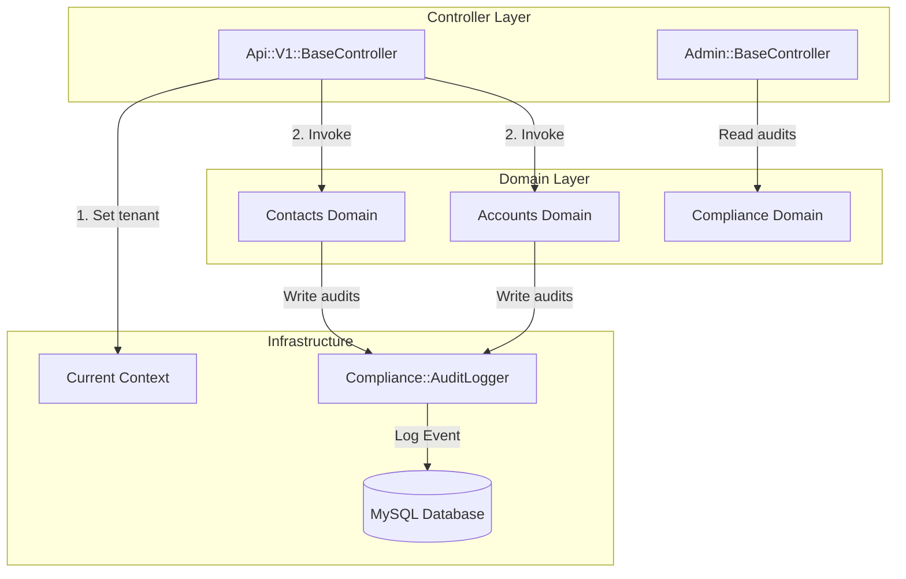
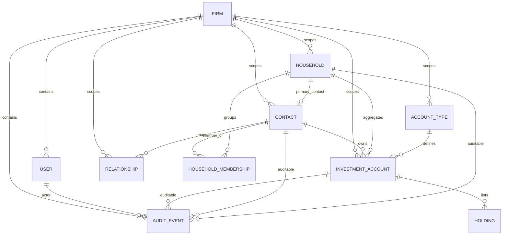

# Apex Financial CRM - Developer Guide

Welcome to the developer guide for the **Apex Financial CRM** application. This document provides an in-depth explanation of the application's architecture, domain boundaries, data models, design patterns, and cross-cutting concerns (multi-tenancy, auditing, API serialization).

---

## 1. Architectural Overview

This application is built on **Ruby on Rails 8.1.3** and follows a **Domain-Driven Design (DDD)** approach. Instead of placing business logic inside traditional ActiveRecord models or controllers, logic is isolated inside domain directories under [app/domains/](file:///c:/Users/johns/DEV/ruby-crm/app/domains/).



### Core Design Guidelines
1. **Fat Services, Thin Controllers**: Controllers are responsible solely for HTTP routing, request parsing, authentication, pagination handling, and rendering JSON via Blueprinter.
2. **Transaction Bound Services**: Database write operations that modify state (e.g., creating accounts, linking contacts, bulk imports) must be wrapped inside a service command using `ActiveRecord::Base.transaction`.
3. **Audit Trail Guarantee**: Any service mutating state MUST record a corresponding audit log using the [Compliance::AuditLogger](file:///c:/Users/johns/DEV/ruby-crm/app/domains/compliance/services/audit_logger.rb) service.
4. **No N+1 Queries**: All queries must use `strict_loading` and explicitly define `preload` or `includes` parameters to ensure performance and prevent N+1 queries.

---

## 2. Multi-Tenancy Architecture

Multi-tenancy is enforced at the database layer using a `firm_id` scoping key.

### Thread-Safe Tenant Context
The [Current](file:///c:/Users/johns/DEV/ruby-crm/app/models/current.rb) model inherits from `ActiveSupport::CurrentAttributes`. It stores the tenant context for the duration of an HTTP request or background execution thread:
* `Current.firm`: The current tenant [Firm](file:///c:/Users/johns/DEV/ruby-crm/app/models/firm.rb) model.
* `Current.user`: The active [User](file:///c:/Users/johns/DEV/ruby-crm/app/models/user.rb) model performing the request.

### Scoping Concern: [FirmScoped](file:///c:/Users/johns/DEV/ruby-crm/app/models/concerns/firm_scoped.rb)
Models that belong to a tenant include the `FirmScoped` concern. This concern automatically:
* Establishes a `belongs_to :firm` association.
* Applies a validation to ensure `firm_id` is always present.
* Registers a `before_validation` callback on creation to set `self.firm` from `Current.firm`.
* Exposes a `.for_firm(firm)` scope for manual scoping where needed.

```ruby
module FirmScoped
  extend ActiveSupport::Concern

  included do
    belongs_to :firm
    scope :for_firm, ->(firm) { where(firm_id: firm&.id) }

    validates :firm_id, presence: true
    before_validation :set_firm_from_current, on: :create
  end
  # ...
end
```

---

## 3. Domain Modules & Capabilities

The core business logic is split into three main modules:

### A. Contacts Domain ([app/domains/contacts](file:///c:/Users/johns/DEV/ruby-crm/app/domains/contacts/))
Manages client demographic records, household grouping, and familial relationships.

* **Models**:
  * [Contacts::Contact](file:///c:/Users/johns/DEV/ruby-crm/app/domains/contacts/models/contact.rb): Client profile containing first/last name, email, date of birth, and relationships.
  * [Contacts::Household](file:///c:/Users/johns/DEV/ruby-crm/app/domains/contacts/models/household.rb): A grouping mechanism for aggregated household assets (e.g. Smith Family Trust). Mentions a `primary_contact` foreign key mapping back to a Contact.
  * [Contacts::HouseholdMembership](file:///c:/Users/johns/DEV/ruby-crm/app/domains/contacts/models/household_membership.rb): Join model linking contacts to households with specific roles (`primary`, `spouse`, `child`, `member`).
  * [Contacts::Relationship](file:///c:/Users/johns/DEV/ruby-crm/app/domains/contacts/models/relationship.rb): Polymorphic relationship links between contacts (e.g. `spouse`, `child`).
* **Services**:
  * [Contacts::CreateContact](file:///c:/Users/johns/DEV/ruby-crm/app/domains/contacts/services/create_contact.rb): Creates a contact and logs a creation audit event.
  * [Contacts::CreateHousehold](file:///c:/Users/johns/DEV/ruby-crm/app/domains/contacts/services/create_household.rb): Instantiates a household group and records it to the audit log.
  * [Contacts::LinkContactToHousehold](file:///c:/Users/johns/DEV/ruby-crm/app/domains/contacts/services/link_contact_to_household.rb): Creates a `HouseholdMembership` and updates the household's audit trail.
* **Queries**:
  * [Contacts::HouseholdDetailQuery](file:///c:/Users/johns/DEV/ruby-crm/app/domains/contacts/queries/household_detail_query.rb): Pulls detailed household records with preloaded memberships, nested contact details, contacts relationships, and active investment accounts, ensuring zero N+1 queries.

### B. Accounts Domain ([app/domains/accounts](file:///c:/Users/johns/DEV/ruby-crm/app/domains/accounts/))
Tracks financial accounts, holding positions, and custodian integrations.

* **Models**:
  * [Accounts::AccountType](file:///c:/Users/johns/DEV/ruby-crm/app/domains/accounts/models/account_type.rb): Categories of accounts (e.g., Traditional IRA, Roth IRA, Joint Brokerage).
  * [Accounts::InvestmentAccount](file:///c:/Users/johns/DEV/ruby-crm/app/domains/accounts/models/investment_account.rb): Investment accounts linked to a contact, household, custodian, and type. Holds a denormalized `current_value` representing total asset value.
  * [Accounts::Holding](file:///c:/Users/johns/DEV/ruby-crm/app/domains/accounts/models/holding.rb): Individual ticker positions (symbol, shares, market value) within an account as of a specific date.
* **Services**:
  * [Accounts::CreateInvestmentAccount](file:///c:/Users/johns/DEV/ruby-crm/app/domains/accounts/services/create_investment_account.rb): Creates an account and creates an audit record.
  * [Accounts::ImportHoldings](file:///c:/Users/johns/DEV/ruby-crm/app/domains/accounts/services/import_holdings.rb): Processes raw holding updates, performs a database upsert (`Holding.upsert_all`), triggers an account balance recalculation, and audits the bulk import action.
  * [Accounts::RecalculateInvestmentAccountValue](file:///c:/Users/johns/DEV/ruby-crm/app/domains/accounts/services/recalculate_investment_account_value.rb): An optimized SQL service that updates the `current_value` of one or more accounts to match the sum of their active `market_value` holdings.
* **Queries**:
  * [Accounts::AumByContactQuery](file:///c:/Users/johns/DEV/ruby-crm/app/domains/accounts/queries/aum_by_contact_query.rb): Generates an ordered list of contacts ranked by total active Assets Under Management (AUM) and count of active accounts.
  * [Accounts::AumByHouseholdQuery](file:///c:/Users/johns/DEV/ruby-crm/app/domains/accounts/queries/aum_by_household_query.rb): Ranks households by aggregated AUM and count of accounts.
  * [Accounts::InvestmentAccountIndexQuery](file:///c:/Users/johns/DEV/ruby-crm/app/domains/accounts/queries/investment_account_index_query.rb): Returns preloaded investment account index relations.

### C. Compliance Domain ([app/domains/compliance](file:///c:/Users/johns/DEV/ruby-crm/app/domains/compliance/))
Audits system activity and detects data inconsistencies or business logic violations.

* **Models**:
  * [Compliance::AuditEvent](file:///c:/Users/johns/DEV/ruby-crm/app/domains/compliance/models/audit_event.rb): Standard record containing actor references, action performed (`created`, `updated`), polymorphic target (`auditable_id`, `auditable_type`), timestamp, and structured JSON payload showing attributes before and after changes.
* **Services**:
  * [Compliance::AuditLogger](file:///c:/Users/johns/DEV/ruby-crm/app/domains/compliance/services/audit_logger.rb): Static recorder wrapper that inserts audit events.
* **Queries**:
  * [Compliance::AuditTimelineQuery](file:///c:/Users/johns/DEV/ruby-crm/app/domains/compliance/queries/audit_timeline_query.rb): Provides standard chronological logs for firm compliance, filterable by target auditable records.
  * [Compliance::IntegrityReportQuery](file:///c:/Users/johns/DEV/ruby-crm/app/domains/compliance/queries/integrity_report_query.rb): Runs raw MySQL performance audits to detect data anomalies (see Section 5 below).

---

## 4. Entity Relationship Diagram

The following diagram illustrates the relationship between models scoped under the tenancy framework. All tables (except `firms`) contain a foreign key reference to `firm_id`:



---

## 5. Compliance & Data Integrity Audits

The system exposes a database health check panel under the **Admin Dashboard** (`/admin`). The [Compliance::IntegrityReportQuery](file:///c:/Users/johns/DEV/ruby-crm/app/domains/compliance/queries/integrity_report_query.rb) is a critical compliance tool that runs raw SQL rules to flag data anomalies:

1. **Orphaned Accounts**: Highlights investment accounts linked to a household, where the account owner (Contact) is *not* a member of that household.
2. **Households Without Primary**: Flags household groups that either do not have a designated primary contact, or where the designated contact does not hold a member role of `"primary"`.
3. **AUM Drift**: Compares the denormalized `current_value` column on the `investment_accounts` table against the raw SQL sum of all individual positions in the `holdings` table. Accounts with discrepant balances are listed for remediation.
4. **Contacts Without Household**: Detects database records for contacts who have not been added to any household memberships, leaving them isolated.
5. **Stale Holdings**: Flags holding positions whose `as_of_date` is older than a specified threshold (default is 7 days ago), indicating that the daily pricing/import feeds have failed to update.

---

## 6. API Conventions & Infrastructure

All API endpoints follow a standardized REST configuration:

### Response Wrapping
The [RenderJsonEnvelope](file:///c:/Users/johns/DEV/ruby-crm/app/controllers/concerns/render_json_envelope.rb) concern wraps all controllers responses in a standardized JSON payload structure:
* **Success Responses**:
  ```json
  {
    "data": { ... },
    "meta": { ... }
  }
  ```
* **Error Responses**:
  ```json
  {
    "errors": [
      {
        "message": "Field is required",
        "code": "invalid",
        "field": "email"
      }
    ]
  }
  ```

### Blueprinters
JSON serialization is handled by the **Blueprinter** gem. Blueprinters are located in [app/blueprints/api/v1/](file:///c:/Users/johns/DEV/ruby-crm/app/blueprints/api/v1/). They define specific rendering profiles (views), such as `:summary` or `:detail`, to control payload size and avoid serialization loops:
* [AccountTypeBlueprint](file:///c:/Users/johns/DEV/ruby-crm/app/blueprints/api/v1/account_type_blueprint.rb)
* [ContactBlueprint](file:///c:/Users/johns/DEV/ruby-crm/app/blueprints/api/v1/contact_blueprint.rb)
* [HoldingBlueprint](file:///c:/Users/johns/DEV/ruby-crm/app/blueprints/api/v1/holding_blueprint.rb)
* [HouseholdBlueprint](file:///c:/Users/johns/DEV/ruby-crm/app/blueprints/api/v1/household_blueprint.rb)
* [HouseholdMembershipBlueprint](file:///c:/Users/johns/DEV/ruby-crm/app/blueprints/api/v1/household_membership_blueprint.rb)
* [InvestmentAccountBlueprint](file:///c:/Users/johns/DEV/ruby-crm/app/blueprints/api/v1/investment_account_blueprint.rb)
* [RelationshipBlueprint](file:///c:/Users/johns/DEV/ruby-crm/app/blueprints/api/v1/relationship_blueprint.rb)
* [AuditEventBlueprint](file:///c:/Users/johns/DEV/ruby-crm/app/blueprints/api/v1/audit_event_blueprint.rb)

### Pagination
Pagination is powered by the **Pagy** gem. Controllers return metadata fields (such as `page`, `pages`, `count`, and `next`) inside the metadata envelope to support cursor-based or offset navigation:
```ruby
pagy, records = pagy(contacts)
render_json_envelope(
  ContactBlueprint.render_as_hash(records, view: :summary),
  meta: pagy.data_hash
)
```

---

## 7. Context Setup & HTTP Headers

For all API requests under `/api/v1/`, authentication is simulated using two headers:
* `X-Firm-Id`: The integer ID of the tenant firm.
* `X-User-Id`: The integer ID of the authenticating advisor user.

### Local Development / Test Fallback
In `development` or `test` environments, if these headers are omitted, the base API controller automatically defaults the context to:
* `Current.firm = Firm.first` (e.g. *Apex Wealth Advisors* as generated by [db/seeds.rb](file:///c:/Users/johns/DEV/ruby-crm/db/seeds.rb)).
* `Current.user = User.first` (e.g. *Sarah Jenkins*).

For production, these headers are strictly required. Missing headers return a `401 Unauthorized` response wrapper.
